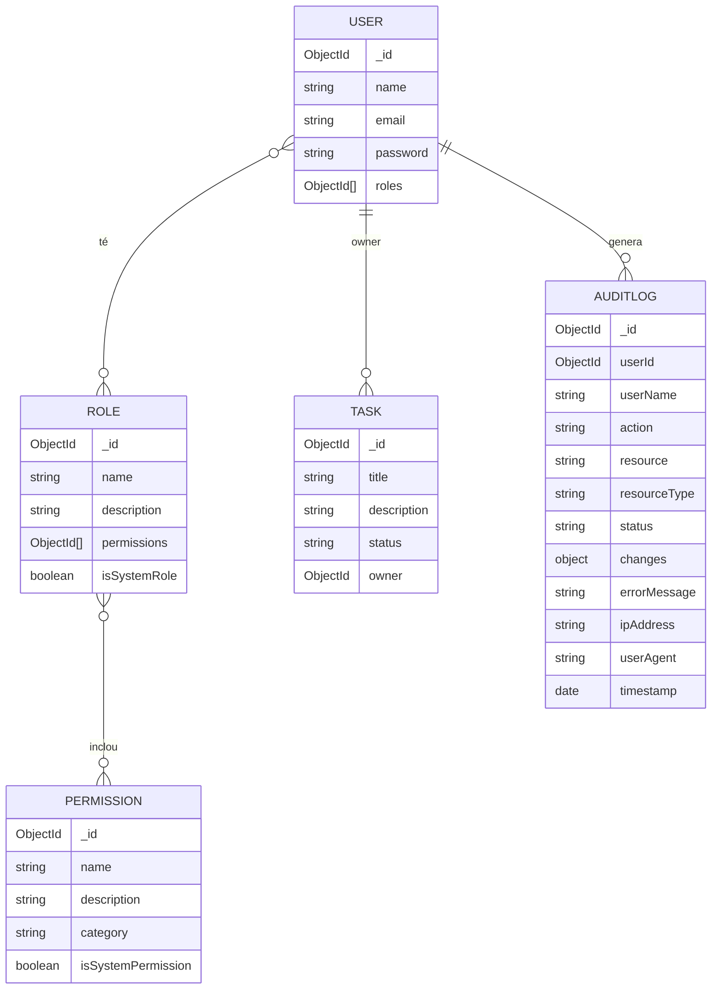

# Task Manager API (T8) — RBAC + Permisos + Auditoria

API REST amb **control d’accés basat en rols (RBAC)**, **permisos granulars** i **auditoria** d’accions.  
Pensada per un projecte acadèmic on cal demostrar: crear permisos, crear rols, assignar rols a usuaris, verificar permisos, obtenir logs i estadístiques d’auditoria, i gestionar rols del sistema.

---

## Característiques

- Autenticació amb **JWT Bearer**
- RBAC:
  - **Usuari** → pot tenir **múltiples rols**
  - **Rol** → conté **múltiples permisos**
- Permisos granulars (`tasks:create`, `roles:manage`, `audit:read`, etc.)
- CRUD de **tasques** (sempre **tasques pròpies**)
- Admin:
  - CRUD de **permisos**
  - CRUD de **rols** (+ afegir/treure permisos del rol)
  - Assignar/treure rols a usuaris
  - Consultar permisos efectius d’un usuari
- **Auditoria**:
  - Registra POST/PUT/DELETE i també GET sensibles sota `/api/admin/*`
  - Registra intents denegats (403) via `checkPermission`

---

## Stack

- Node.js + Express
- MongoDB + Mongoose
- JWT (`jsonwebtoken`)
- Validacions: `express-validator`
- Logging dev: `morgan`
- Dev runner: `nodemon`

---

## Setup i execució

### Prerequisits
- Node.js (LTS recomanat)
- MongoDB (local o Atlas)

### Instal·lació
```bash
npm install
```

### Variables d’entorn
Crea un fitxer `.env` a l’arrel (pots partir de `.env.example`):

```env
PORT=3000
MONGO_URI=mongodb://127.0.0.1:27017/task_manager_t8
JWT_SECRET=posa_un_secret_fort
JWT_EXPIRES_IN=7d
NODE_ENV=development
CORS_ORIGIN=*
```

> `JWT_SECRET` és obligatori. Si falta, el middleware d’auth no podrà verificar tokens.

### Arrencar en desenvolupament
```bash
npm run dev
```

### Arrencar en producció
```bash
npm start
```

### Seeds (permisos + rols)
El servidor, en arrencar, executa un seeding idempotent (`utils/seedAll.js`) per assegurar que existeixen:
- permisos del sistema
- rols per defecte

També pots executar-ho manualment:
```bash
npm run seed
```

---

## Sistema de permisos (RBAC)

### Com funciona
1) L’usuari s’autentica i obté un token JWT.  
2) El middleware `auth` carrega l’usuari i fa `populate` de `roles` + `permissions`.  
3) El middleware `checkPermission('x:y')` comprova si l’usuari té el permís requerit.  
4) Si no el té:
- retorna **403**
- registra auditoria de l’intent denegat

### Permisos del sistema (seed)
Es creen aquests permisos (marcats com `isSystemPermission=true`):

**Tasks**
- `tasks:create`, `tasks:read`, `tasks:update`, `tasks:delete`

**Users**
- `users:manage`, `users:read`

**Roles**
- `roles:manage`, `roles:read`

**Permissions**
- `permissions:manage`, `permissions:read`

**Audit**
- `audit:read`

**Reports**
- `reports:view`, `reports:export`

### Rols per defecte (seed)
- `admin` (rol del sistema, `isSystemRole=true`): **tots** els permisos
- `user` (rol del sistema, `isSystemRole=true`): CRUD de tasques (tasques pròpies)
- `viewer`: només `tasks:read`
- `editor`: CRUD tasques

Notes importants:
- No es pot **eliminar** un rol del sistema (`admin`, `user`).
- No es pot **renombrar** un rol del sistema.
- En registrar un usuari nou (`POST /api/auth/register`), se li assigna el rol `user`.

---

## Tasques pròpies (scoping per owner)

Encara que tinguis `tasks:read`, les rutes de tasques sempre fan:
- `Task.find({ owner: req.user._id })`
- `Task.findOne({ _id: ..., owner: req.user._id })`

Això vol dir que l’API està pensada perquè **cada usuari només vegi i manipuli les seves tasques**.

---

## Models i diagrama de relacions

### Models
- `User`
  - `roles: ObjectId[] -> Role`
- `Role`
  - `permissions: ObjectId[] -> Permission`
  - `isSystemRole: boolean`
- `Permission`
  - `isSystemPermission: boolean`
- `Task`
  - `owner: ObjectId -> User` (obligatori)
- `AuditLog`
  - `userId: ObjectId -> User`
  - `status: success|error`
  - `changes`, `errorMessage`, `ipAddress`, `userAgent`, `timestamp`

### Diagrama (Mermaid)


---

## Rutes i permisos requerits

### Health
- `GET /health` (públic)

### Auth (`/api/auth`)
- `POST /api/auth/register` (públic)  
  Body: `{ name, email, password }`
- `POST /api/auth/login` (públic)  
  Body: `{ email, password }`
- `GET /api/auth/me` (auth)
- `POST /api/auth/check-permission` (auth)  
  Body: `{ permission: "tasks:delete" }`

### Tasks (`/api/tasks`) (auth + permisos)
- `GET /api/tasks` → `tasks:read`
- `GET /api/tasks/:id` → `tasks:read`
- `POST /api/tasks` → `tasks:create`
- `PUT /api/tasks/:id` → `tasks:update`
- `DELETE /api/tasks/:id` → `tasks:delete`

### Admin (`/api/admin`) (auth + permisos)
**Usuaris**
- `GET /api/admin/users` → `users:read`
- `POST /api/admin/users/:userId/roles` → `users:manage`
- `DELETE /api/admin/users/:userId/roles/:roleId` → `users:manage`
- `GET /api/admin/users/:userId/permissions` → `users:read`

**Rols**
- `POST /api/admin/roles` → `roles:manage`
- `GET /api/admin/roles` → `roles:read`
- `GET /api/admin/roles/:id` → `roles:read`
- `PUT /api/admin/roles/:id` → `roles:manage`
- `DELETE /api/admin/roles/:id` → `roles:manage`
- `POST /api/admin/roles/:id/permissions` → `roles:manage` (afegir permís al rol)
- `DELETE /api/admin/roles/:id/permissions/:permissionId` → `roles:manage` (treure permís del rol)

**Permisos**
- `POST /api/admin/permissions` → `permissions:manage`
- `GET /api/admin/permissions` → `permissions:read`
- `GET /api/admin/permissions/categories` → `permissions:read`
- `PUT /api/admin/permissions/:id` → `permissions:manage` (només actualitza `description`)
- `DELETE /api/admin/permissions/:id` → `permissions:manage` (no permet eliminar permisos del sistema)

**Auditoria**
- `GET /api/admin/audit-logs` → `audit:read`  
  Query: `userId`, `action`, `startDate`, `endDate`, `page`, `limit`
- `GET /api/admin/audit-logs/stats` → `audit:read`
- `GET /api/admin/audit-logs/user/:userId` → `audit:read`
- `GET /api/admin/audit-logs/:id` → `audit:read`

---

## Exemples d’ús (curl)

> Recorda: posa `Authorization: Bearer <TOKEN>` a les rutes protegides.

### 1) Register (usuari normal, rep rol `user`)
```bash
curl -X POST http://localhost:3000/api/auth/register   -H "Content-Type: application/json"   -d '{"name":"User 1","email":"user1@example.com","password":"user1234"}'
```

### 2) Login (retorna token)
```bash
curl -X POST http://localhost:3000/api/auth/login   -H "Content-Type: application/json"   -d '{"email":"user1@example.com","password":"user1234"}'
```

### 3) Crear permís (admin)
```bash
curl -X POST http://localhost:3000/api/admin/permissions   -H "Authorization: Bearer <ADMIN_TOKEN>"   -H "Content-Type: application/json"   -d '{"name":"inventory:read","description":"Veure inventari","category":"inventory"}'
```

### 4) Crear rol (admin) amb permisos (IMPORTANT: aquí es passen NOMS de permís)
```bash
curl -X POST http://localhost:3000/api/admin/roles   -H "Authorization: Bearer <ADMIN_TOKEN>"   -H "Content-Type: application/json"   -d '{
    "name":"inventory_viewer",
    "description":"Només lectura inventari",
    "permissions":["inventory:read","tasks:read"]
  }'
```

### 5) Assignar rol a usuari (admin)
```bash
curl -X POST http://localhost:3000/api/admin/users/<USER_ID>/roles   -H "Authorization: Bearer <ADMIN_TOKEN>"   -H "Content-Type: application/json"   -d '{"roleId":"<ROLE_ID>"}'
```

### 6) Obtenir permisos efectius d’un usuari (admin)
```bash
curl -X GET http://localhost:3000/api/admin/users/<USER_ID>/permissions   -H "Authorization: Bearer <ADMIN_TOKEN>"
```

### 7) Verificar permís (èxit / error)
```bash
curl -X POST http://localhost:3000/api/auth/check-permission   -H "Authorization: Bearer <TOKEN>"   -H "Content-Type: application/json"   -d '{"permission":"tasks:delete"}'
```

### 8) Crear tasca (usuari)
```bash
curl -X POST http://localhost:3000/api/tasks   -H "Authorization: Bearer <TOKEN>"   -H "Content-Type: application/json"   -d '{"title":"Comprar llet","description":"2L","status":"pending"}'
```

### 9) Logs d’auditoria (admin) + filtres
```bash
curl -X GET "http://localhost:3000/api/admin/audit-logs?action=roles:manage&page=1&limit=20"   -H "Authorization: Bearer <ADMIN_TOKEN>"
```

### 10) Estadístiques d’auditoria (admin)
```bash
curl -X GET http://localhost:3000/api/admin/audit-logs/stats   -H "Authorization: Bearer <ADMIN_TOKEN>"
```

---

## Casos d’error documentats

### Format general d’error
L’API respon així quan es llença un `ErrorResponse`:
```json
{
  "success": false,
  "error": "Missatge d'error",
  "details": "Opcional"
}
```

### 401 — Token absent o invàlid
- **Causa**: falta `Authorization: Bearer ...` o token invàlid/expirat
- **Resposta**:
```json
{ "success": false, "error": "Not authorized" }
```

### 400 — Validació incorrecta
Exemple: `POST /api/tasks` sense `title`
```json
{
  "success": false,
  "error": "Validació incorrecta",
  "details": [
    { "type":"field", "msg":"...", "path":"title", "location":"body" }
  ]
}
```

### 400 — Email ja registrat
`POST /api/auth/register` amb email existent
```json
{ "success": false, "error": "Email ja registrat" }
```

### 401 — Credencials incorrectes
`POST /api/auth/login` amb password erroni
```json
{ "success": false, "error": "Credencials incorrectes" }
```

### 403 — Permís denegat
Quan `checkPermission()` bloqueja una ruta:
```json
{
  "success": false,
  "error": "No tens permís per fer aquesta acció",
  "details": { "permission": "roles:manage" }
}
```
> Aquest intent queda registrat a l’auditoria com a `status=error`.

### 403 — Proteccions del sistema
- Eliminar un permís del sistema:
```json
{ "success": false, "error": "No pots eliminar permisos del sistema" }
```
- Eliminar un rol del sistema:
```json
{ "success": false, "error": "No pots eliminar un rol del sistema" }
```
- Renombrar rol del sistema (`admin` o `user`):
```json
{ "success": false, "error": "No es pot renombrar rols del sistema (admin, user)" }
```

### 404 — Recursos no trobats
- Tasca d’un altre usuari o id inexistent:
```json
{ "success": false, "error": "Tasca no trobada" }
```
- Rol/permís inexistent:
```json
{ "success": false, "error": "Rol no trobat" }
```

### 400 — No permetre usuari sense rol
`DELETE /api/admin/users/:userId/roles/:roleId` quan només li queda 1 rol:
```json
{ "success": false, "error": "No permetre que un usuari quedi sense rol" }
```

---

## Auditoria (AuditLog)

Es registra automàticament:
- **Tots** els `POST/PUT/DELETE`
- `GET` sensibles sota `/api/admin/*`

Es guarda:
- usuari, acció (ex: `roles:manage`), recurs, tipus, `status`, canvis, error, IP, user-agent i `timestamp`.

Filtres disponibles a `GET /api/admin/audit-logs`:
- `userId=<id>`
- `action=<acció>`
- `startDate=YYYY-MM-DD` / `endDate=YYYY-MM-DD`
- `page`, `limit` (limit màxim 100)

---

## Notes finals

- Aquest projecte està pensat perquè sigui fàcil de provar amb Postman (captures típques: crear permís, crear rol, assignar rol, obtenir permisos d’usuari, verificar permís, obtenir logs i stats).
- Les rutes de tasques estan restringides a **tasques pròpies** per disseny.

